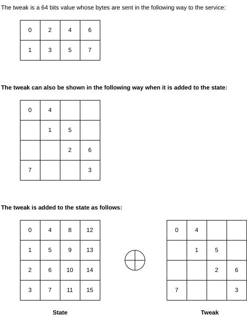
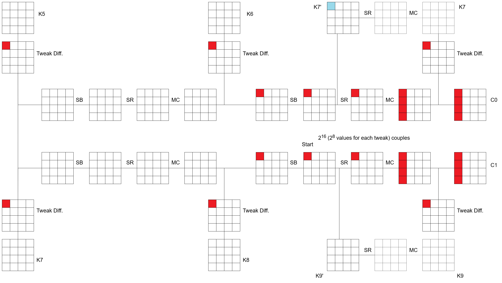

# Back to the FORK [_snakeCTF 2024 Quals_]

**Category**: Crypto

## Description

Try to find out what is the key used by our strong encryption system.
You will find a list of integers, convert to bytes and hex, then put it
within our flag format: `snakeCTF{...}`

P.S. the solver script could run for ~5-6 minutes.
Please, make the script parallelizable, otherwise it could take ~25 minutes.
If you receive TIMEOUT errors, please contact us.

## Solution

### Analysis

The first thing to notice is that the cipher is a so-called fork cipher. In particular, it is a tweakable AES-based forkcipher that splits the state after 5 rounds. Fork-ciphers have got 3 main functions:

- encrypt
- decrypt
- compute_sibling

The attack involves the concepts of **differential cryptanalysis** and **reflective trails**.
By searching on a search engine this [article](https://eprint.iacr.org/2019/289.pdf) can be found. The given cipher is a round-reduced version of the one given in the paper, in particular, by following the convention, it can be called ForkAES-5-2-2. The only difference in the schema is given by the keys involved after the fork. The first fork uses $K_5, K_6, K_7$, the second one uses $K_7, K_8, K_9$.

Recall the sentence from last year writeup: [TheFORK challenge - snakeCTF 2023](https://github.com/MadrHacks/snakeCTF2023-Writeups/blob/master/crypto/thefork/writeup.md).
Last year it was possible to control each byte due to the fact that the system used a 128 bits tweak. This year the tweak is shorter, 64 bits, and it is added in the following way:

This led to the full control of the bytes `0,4,5,9,10,14,15,3` (with respect to the 4x4 matrix visualisation)
But, how the reflection trail is used in out context? The following image will help to understand where the difference has to be applied and how the difference introduced by the tweaks is used to derive the valid possibilities for each byte under control.

**Note**: in the image above, $\tilde{K} = K'$.

Last year it was possible to find ~2 possibilities for each byte of $K_7$, meaning that at maximum $2^{16}$ keys had to be tested. But, this version only gives ~2 possibilities (per byte) for the 8 bytes of $\tilde{K}_7$ under control. How is it possible to derive the remaining 8 bytes?

By applying the attack on the other direction (from left to right) it is possible to find ~2 possibilities for each byte of $\tilde{K}_9$ under control.
Is it possible to derive the other bytes by knowing columns `0 and 1` of $\tilde{K}_7$ and $\tilde{K}_9$?
For ease of notation, let $\tilde{K}_i^{(j)}$ be the j-th column of $\tilde{K}_i$.

- $\tilde{K}_8^{(1)} = \tilde{K}_9^{(1)} \oplus \tilde{K}_9^{(0)}$
- $\tilde{K}_8^{(0)} = K_8^{(1)} \oplus \tilde{K}_7^{(1)}$
- $\tilde{K}_7^{(3)}$ can be found from $\tilde{K}_8^{(1)}$ and $\tilde{K}_7^{(1)}$ (pay attention to consider the `SBOX` and `Rcon` values. Follow the key scheduling algorithm directives)
- $\tilde{K}_8^{(3)}$ from $\tilde{K}_9^{(1)}$ and $\tilde{K}_8^{(1)}$ (pay attention to consider the `SBOX` and `Rcon` values. Follow the key scheduling algorithm directives)
- $\tilde{K}_8^{(2)} = \tilde{K}_8^{(3)} \oplus \tilde{K}_7^{(3)}$

At this point, the full $\tilde{K}_8$ is found. After applying the shift-row and the mix-column operations, the derived $K_8$ can be tested. How many keys to test?
This exploit permits obtaining ~2 possibilities for each byte under control which means that at maximum $2^{16}$ keys should be tested.

To learn something about differential cryptanalysis, these are some references:

- [Linear and differential cryptanalysis on SPN-like ciphers](http://www.cs.bc.edu/~straubin/crypto2017/heys.pdf)
- [Linear and differential cryptanalysis: general overview](https://summerschool-croatia.cs.ru.nl/2014/slides/Differential%20and%20Linear%20Cryptanalysis.pdf)

### Flag

Once the key is found, the flag can be discovered.

### Code

[Here](./attachments/solve.py) is the solver code.
