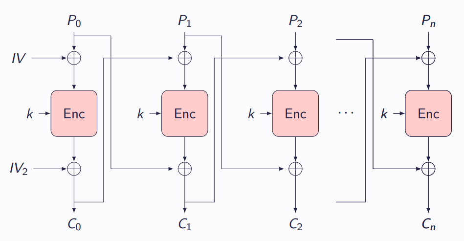
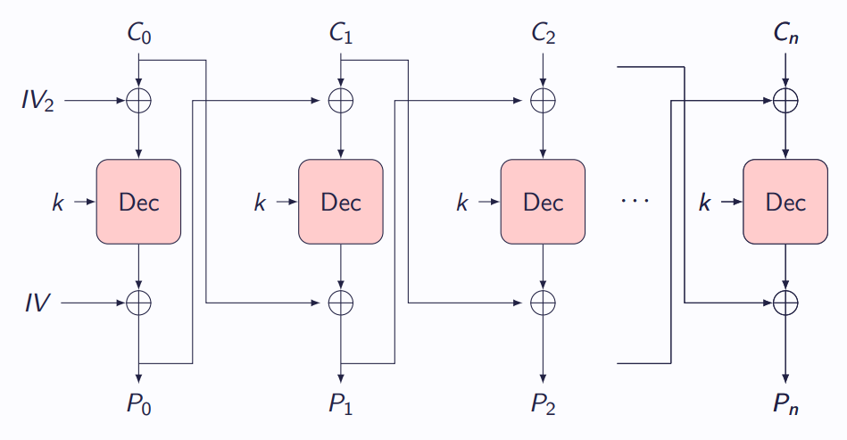

# In tun Group di Esperts [_snakeCTF 2024 Quals_]

**Category**: Crypto

## Description

Unfortunately it is not so easy to communicate with a person who speaks only in Friulan language.

## Solution

### Analysis

It is a communication with an expert that can only understand messages encrypted with the IGE mode of operation.
IGE block cipher mode became famous after being used in Telegram.

Encryption and Decryption are shown in the following image

### Exploit

The vulnerability is given by a common padding oracle. With respect to the well-known CBC padding oracle it requires to:

- start the attack from the first block
- modify the byte keeping in mind the effect given by the application of $IV_2$
- modify $IV$

What happens is that it is possible to decrypt the considered block by considering the output from the padding oracle with:

- The original initialisation vectors while decrypting the first block
- the previous plaintext and ciphertext block as initialisation vectors for subsequent blocks.

Starting from the first block, one plaintext block per step can be correctly decrypted.
It means that at the beginning $IV$, $IV_2$ and $C_0$ must be used to find $P_0$.

To find the second block, $IV = C_0$ and $IV_2 = P_0$. Then $P_1$ is found from $C_1$.

At the $i$-th step, $IV = C_{i-1}$, $IV_2 = P_{i-1}$ and $P_i$ is retrieved from $C_i$.

Proceeding in this way all the blocks are retrieved.

### Code

[Here](./attachments/solve.py) is the solver code.
