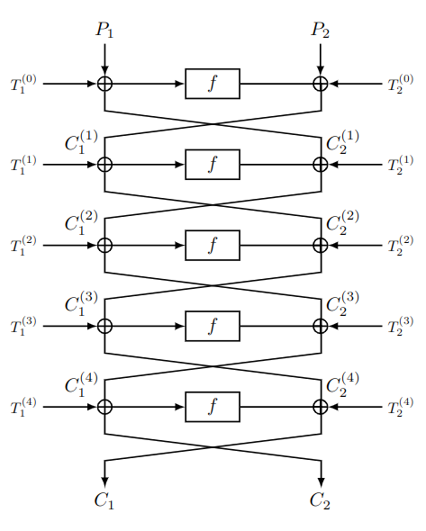

# this iS not PN [_snakeCTF 2024 Quals_]

**Category**: Crypto

## Description
I'm a symmetric cryptography expert and I think permutation networks are always impossible to break, no matter of what components are used.

## Solution
### Analysis
We are provided with the encryption of the flag after 5 rounds and 6 rounds. Why? With 5 rounds you can find the first half of the flag, whilst the second half can be found by exploiting the 6 rounds ciphertext. 
The goal is to write the equations for both the instances and find some relations that can help to obtain the desired blocks. 

### The cipher
Given a key $K$, each round of the cipher works as shown by the following image:
 

Where, given a key $k$, the function $f$ is defined as $f(X,k) = X \oplus \text{sha1}(k)$. For ease of notation, $K = \text{sha1}(k)$.

### The relations

From the 5 round instance:

$C_2^{(3)} = T_2^{(3)} \oplus  T_2^{(4)} \oplus  C_1 \oplus T_1^{(4)}$

$C_2^{(2)} = C_2^{(3)} \oplus  T_2^{(2)} \oplus T_1^{(3)} \oplus C_1 \oplus C_2 \oplus T_2^{(4)}$

$P_2 = T_2^{(1)} \oplus T_1^{(2)} \oplus C_2^{(3)} \oplus T_2^{(0)} \oplus T_1^{(1)}$

From the 6 round instance:

$C_2^{(4)} = T_2^{(4)} \oplus  T_2^{(5)} \oplus  C_1 \oplus T_1^{(5)}$

$C_2^{(1)} = T_2^{(2)} \oplus T_1^{(3)} \oplus C_2^{(4)} \oplus T_2^{(1)} \oplus T_1^{(2)}$

$P_1 = C_2^{(1)} \oplus T_1^{(0)}$

### Flag
The flag is the concatenation of $P_1$ and $P_2$.

### Code
[Here](./attachments/solve.py) is the solver code.