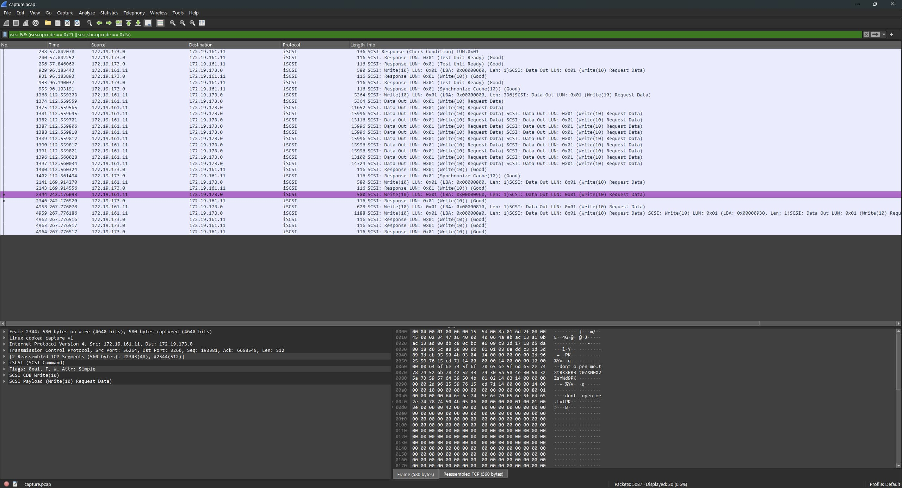
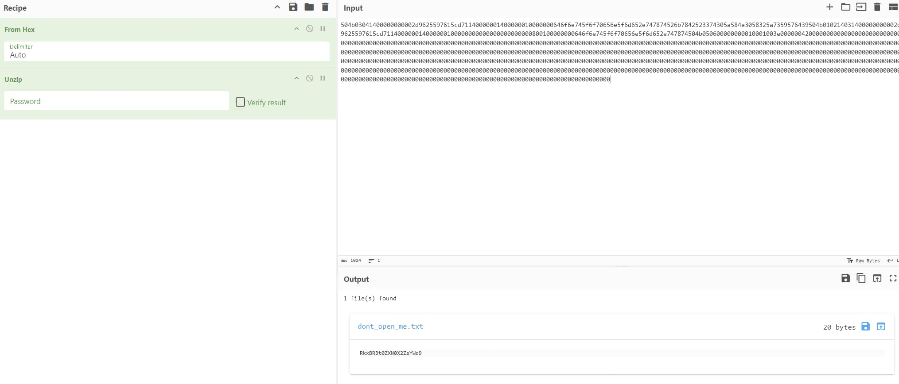

# remote storage [_snakeCTF 2024 Quals_]

**Category**: network

## Description

All my homies hate cloud storage.

## Solution

### Understanding the capture

By looking at the protocol hierarchy statistics in Wireshark,
it is possible to see that the traffic is mostly composed of iSCSI packets.
Knowing that the challenge is named "remote storage", it is safe to assume that the challenge is about iSCSI.

### What is iSCSI?

iSCSI (Internet Small Computer System Interface) is a protocol that enables the transmission of the SCSI protocol over TCP/IP networks. SCSI (Small Computer System Interface) is a set of standards for physically connecting and transferring data between computers and peripheral devices. In the 1980s, SCSI was the primary interface used to connect hard drives and other devices to computers. Nowadays, iSCSI is used in small-scale servers as an alternative to Fiber Channel.

### Analysing the traffic

Because the challenge is about iSCSI, it can be assumed that the flag is stored in one of the iSCSI read responses or write requests.
So, by filtering the packets to show only the ones that contain actual data, it is possible to reduce the number of packets to analyse.

`iscsi && (iscsi.opcode == 0x21 || scsi_sbc.opcode == 0x2a)`

By manually analysing the packets, it is possible to see a packet that contains the string "dont_open_me.txt" inside the payload.
After further analysis, it is possible to see that the payload is a zip file.
So, by extracting the payload and importing it into CyberChef, it is possible to extract the file "dont_open_me.txt" and get the flag.

