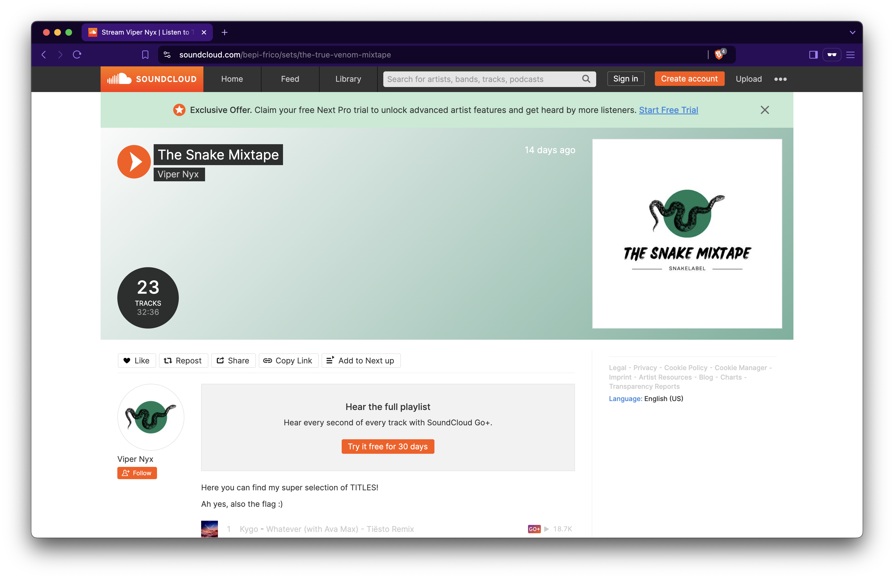

# aAaaAaAaAaaAAArGHH [_snakeCTF 2024 Quals_]

**Category**: OSINT

## Description

I can't stand that the bad guy has done it again. It's impossible, how a person with ZERO talent came out with a contract with a label? aAAAAAAAAAaaaa I have to do something, his music is poo-poo, and I'm here, I'm ducking ducking here (semicit). I've never been so angry!!!!!

Ah yes, you may wanna solve Young Wannabe First :D

Flag format: `snakeCTF{PRIC}`[1]

[1] (Please Read It Carefully, there are just letters, cmon you can do it)

## Solution

The description talks about a bad guy who has signed a contract with a label, but the author is angry because the bad guy has zero talent.

What kind of label? A music label, of course.

Why it's suggested to solve Young Wannabe first? Because the bad guy is "Bepi Frico", the "CEO of the Skies".

It's possible to deduce that he is the bad guy from his LinkedIn posts. Also, in one of them, he suggests contacting him via email.

Linked to the profile of Bepi Frico, the email address can be found:

> bepifrico@gmail.com

After contacting him:

```
Hi! I wanted to know more about your music. Can you send me some of your tracks?
```

He replies with an OOO:

```
Hello there,
I’ve got some good news and I’ve got some bad news. The bad news is that I’m out of the office. The good news? I’m out of the office… on vacation!

I’ll never be back. Please don’t hesitate to contact everyone else at something that doesn't require my attention, if you require an immediate response.

I look forward to reconnecting once I’m back.

Best,
Vip. Nyx.

PS: Maybe you'll enjoy my music in the meanwhile...
```

The mail is signed by Vip. Nyx.

Who is Vip. Nyx.?
A quick look on one of the biggest music streaming services available (SoundCloud) clarifies the doubts.

If one looks for Vip. Nyx. on SoundCloud, his profile comes up:



Now, it can be seen that he has a playlist with a strange description:

> Here you can find my super selection of TITLES!
>
> Ah yes, also the flag :)

This is clearly the right place.

It's time to find the flag in the playlist... but how?

Based on the description, it's understandable that the characters of the flag are in the playlist.
More specifically, the flag is made of the initials characters in the songs titles:

> weddingcakeskibidisnake

It suffices to add `snakeCTF{}` to get the flag:

> snakeCTF{weddingcakeskibidisnake}
