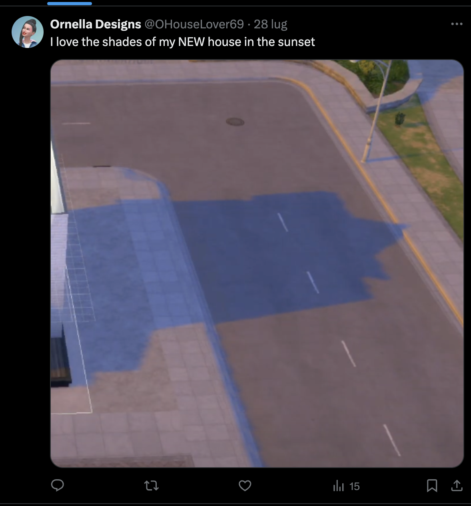
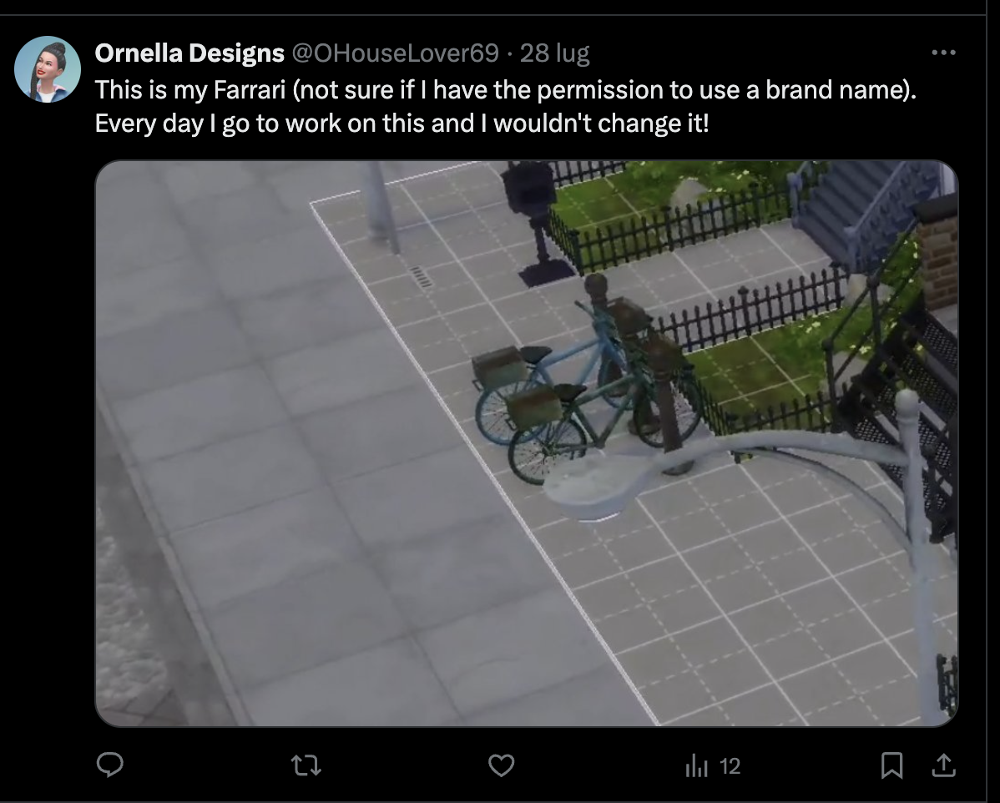
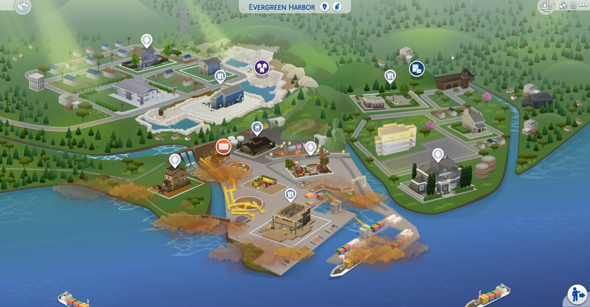

# Eco Lifestyle [_snakeCTF 2024 Quals_]

**Category**: OSINT

## Description

My friend Ornella just arrived at her new home. I'm very happy for her!!!! I want to make her a surprise party in her garden, but I don't remember the position of her house. Help me pls.

I know she's a very "social person" so I think it'll be easy to find it out. Let me see what can be useful... She has a dog, Charles, Charlie, Donkey, mhh I don't remember. Ah yes! She is an interior designer!

Flag format: `snakeCTF{NeighborhoodName_LotName}`

## Solution

The description of the challenge gives some hints about the target's social media presence.
Analysing it, it's possible to discover the target's Name (Ornella) and the name of her dog (one of Charles, Charlie or Donkey) and that she's an interior designer.

The next step is to search for Ornella's social media profiles. The most common platforms are Facebook, Instagram, X and LinkedIn.
A rapid search on Facebook and Instagram with the name "Ornella" and the dog's name plus the keyword "interior designer" is useless.

Another approach is needed, and if the lookup is done on X, the target's profile is found. The profile contains the target's name and the profession:

The profile also contains the dog's name for proof:

(Notice that the dog's name is "Carlo" which is the Italian translation of Charles and Charlie)

Also, it's possible to notice that the target is a Sim (from the EA game The Sims 4). It's possible to restrict the search area to only the Sims 4.

An important information to beat this challenge is the title. "Eco Lifestyle" is an expansion pack for The Sims 4 which adds a particular neighborhood called "Evergreen Harbor". It's very likely that the target is using the Eco Lifestyle expansion pack.

How can this theory be proven? By looking at the target's post on X:

Of course, the lottos that are occupied by other families have to be ignored. Also, by visiting Community Spaces and using a wiki page about the expansion pack, it's possible to find the names of the remaining lottos:

- Miner Mansion
- Rockridge Springs
- Stonestreet Apartments #3 and #4
- Canal Corner
- Sprucewood Square
- Pinecrest Apartments #402 and #404
- The Shipping Views

Now having a look at the map: 

It's possible to exclude other lottos and find the target's house.

1. From the photos it's possible to see that the house is near a portion of street that is very similar to the borders of Canal Corner with the grey pavement and the street with the yellow line.
2. It's possible to tell from the map of the free lottos that the house is or in Canal Corner or in Sprucewood Square (the only two lottos that are buildable).

Now, the only thing left is to find the exact position of the house.

A quick look at the houses in Canal Corner and Sprucewood Square reveals that the house is in Canal Corner (just google the name + houses or go to YouTube, or even look at the map in the game).

So the only thing left is to find out the neighbourhood name. That's easy to do by looking at the map of the world in the game. The neighbourhood is called "Conifer Station".

So the flag is
`snakeCTF{ConiferStation_CanalCorner}`
