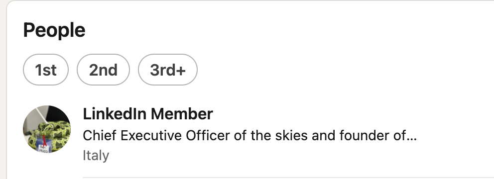
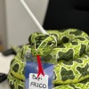
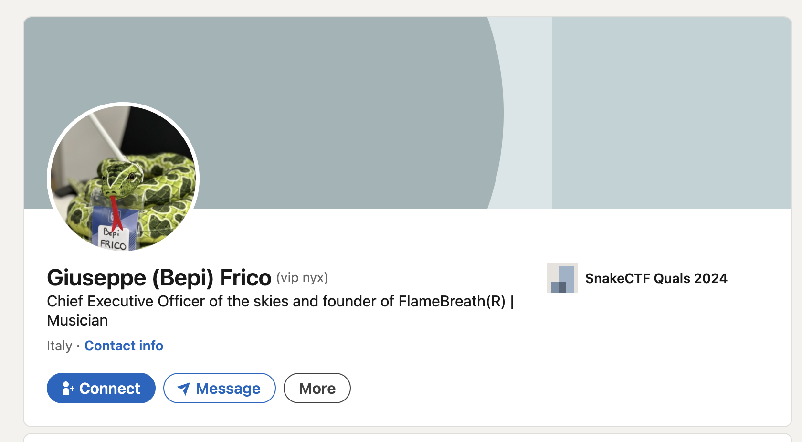
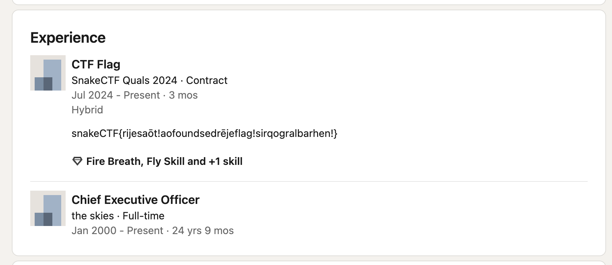

# Young Wannabe [_snakeCTF 2024 Quals_]

**Category**: OSINT

## Description

Last week ordered a new wallet on Snamazon, but instead,
I received a strange message, a packet of matches and a business card from a JēdrarCEO...

### Hints

- Consider using [this](https://lingojam.com/EnglishtoValyrianTranslator) as a translator if you are struggling to find a good one.
- Also, read carefully the challenge description (not the attachment, the actual challenge description): you can find really important information in there!
- CEO is an english word and doesn't need a translation

## Solution

It is given this message:

> Isse shadows deep, skoriot secrets dwell, <br/>
> iā tyvaros spun iā curious vestriarzir, <br/>
> iemnȳ zȳhon coils, ambition swelled, <br/>
> iā yearning dream naejot tip se scale. <br/> > [...]

To find the language in which the text is written, it's possible to google the whole text.

Many results will appear, and from some of them, it's possible to see that the text is written in High Valyrian, a fictional language from the HBO series Game of Thrones (which is very recommended).

The text is a poem, and the challenge's title is a hint. Why? Because the poem tells the story of a young snake who wants to become a dragon. The poem is about ambition and dreams, and it's not generated by ChatGPT. I swear. _Giurin giurello_.

Although the poem is in High Valyrian, the description is in English, so it's possible to use it to find the flag if a trip down "high-valerian land" is unwanted.

> I received a strange message, a packet of matches and a business card from a JēdrarCEO...

What's a Jēdrar CEO?

A look at https://lingojam.com/EnglishtoValyrianTranslator is enough to translate "Jēdrar" into English. The result is "Skies".

It remains to be found who the self-proclaimed CEO of the Skies is.

Where do CEOs usually hang out?
On LinkedIn, of course.

Another hint about the need to search on LinkedIn derives from the complete translation of the poem.

- The poem tells the story of a serpent that dreams to be a dragon, telling his ambitions and desires.
- It tells also that the serpent is keen on telling stories to the public about its wings and fire ability.
- It tells about wars and battles he won and about his successes

The perfect summary of an average LinkedIn post!

So it remains to find the LinkedIn profile of a snake, which is a young CEO (from the challenge description) who wants to become a dragon (from the poem).

The following query can be tried:

```
CEO of the skies
```

The LinkedIn profile of a young CEO who wants to become a dragon is found:



Although it cannot be accessed, the name of the CEO is visible in the preview picture:



From the tag in the photo, it's possible to notice that the family name is Frico.

So a modification to the query is necessary to find the LinkedIn profile of Frico as:

```
CEO of the skies frico
```

Bepi Frico is found:



And with him, the flag:


