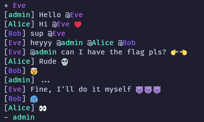

# 🐍 snakechat 💬 [_snakeCTF 2024 Quals_]

**Category**: pwn

## Description



## Solution

snakechat is a simple chat application built on top of a custom protocol with a Python server and a C client. The target of the challenge is to exfiltrate the flag from a `admin` bot by gaining code execution in the C client without having direct access to it.

### Protocol

The protocol is text-based and every packet consists of a string identifying the packet type and a variable number of arguments, separated by `\t`.

Some common structures have a common format, such as string being represented as `STR_LEN\tSTR` and lists being `LIST_LEN\tITEM1\tITEM2\t...`.

The communication begins with the client sending a `LOGIN` packet containing a preferred username.

The server then replies with a `LOGIN_OK` containing the assigned username (which is random if the requested one is already taken) and a list of currently connected clients.

The server will send a `JOIN` or a `LEAVE` packet to all clients whenever a new client joins or leaves the chat.

To send a message, the client sends a `MSG` packet with the message content and optionally a list of arguments, the server then broadcasts it with a `NEW_MSG` packet adding the sender's id.

### Vulnerability

The mentions are implemented by a custom printf specifier (`%U`) that takes the user id as an argument and outputs a correctly coloured username. However, no validation is done on the amount or on the kind of `printf` specifier, thus leading to a `printf` format string vulnerability.

### Leaks

Of course no trivial leaks are possible due to the lack of any kind of output from the bot. No arbitrary writes are possible either as ASLR is enabled and the executable is position-independent, however a few observations can be made:

- All of `thread_recv` (the thread responsible for the incoming packets) allocations are not on the main arena (as it's not the main thread)
- Non-main arena heaps have a [certain alignment](https://elixir.bootlin.com/glibc/glibc-2.39.9000/source/malloc/arena.c#L144) dependent on [`heap_max_size()`](https://elixir.bootlin.com/glibc/glibc-2.39.9000/source/malloc/arena.c#L144) and this results at least in a 0x1000000 alignment. This can be easily noticed by having a look at the memory map of the client process
- Allocations are deterministic and due to the alignment it is possible to overwrite up to three bytes of a non-main arena pointer without bruteforcing

The only operations the bot performs are sending `Hello @username` when a user joins and `Bye username` when a user leaves after a short delay, with other kinds of chat messages being sent to `/dev/null`. Further analysis on the mention processing code leads to the `replace_mentions` function, which iterates over the connected clients (a linked list where each item is a pair composed of the username and the user id) and replaces each instance of a `@username` with the corresponding user id.

If an attacker were to create a fake entry in the list containing the references to the clients with the right username and a user id set to arbitrary data, it would be possible to leak that data by getting the bot to mention that user. That would lead to a message containing "Hello %U" as text and the arbitrary data inside the arguments' list.

Looking at the related struct, that is

```c
struct client_info {
    char* name;
    userid_t id;
};

struct list_item_t {
    struct client_info* item;
    struct list_item_t* next;
};
```

A possible way to achieve the descripted scenario is to overwrite the item pointer of a `list_item_t` such that it points to the entry itself, thus causing the `id` field to overlap with the items' `next` pointer and the `name` field with the pointer to the targeted `list_item_t` struct. This however results to the item's address in memory being interpreted as the username which requires it to be a valid string matching the bot's name _regex_ (`[a-zA-Z0-9\-_]+`). That can be achieved, taking into account the previously made observations, with some basic heap grooming such that the location of the targeted item ends with bytes evaluating to a valid string (e.g. `0x7fffff003070`, which when interpreted as a string is `\x70\x30\x00` (`p0`)).

Now, with a heap leak, it is easy to repeat the same technique to pretty much every location relative to it, for example the arena's `next` pointer, which leads to `libc`'s main arena. From there it is possible to leak the stack through `environ`, and the binary's base through any return address on it.

### Exfiltrating the flag

Having gained an arbitrary write primitive and leaks to both the main stack and the binary, it is now possible to ROP in the main thread. A simple call to `system` won't be enough as there is no access to the binary's `stdio`, so a different approach is needed.

An idea could be to open the flag file, set `stdin`'s `fd` to the flag's `fd` and get the client to interpret the flag as a user typing a message. This will lead to the flag being sent as a message for all the connected clients to see.

For more information on this approach, see the [provided exploit](attachments/solve.py).
