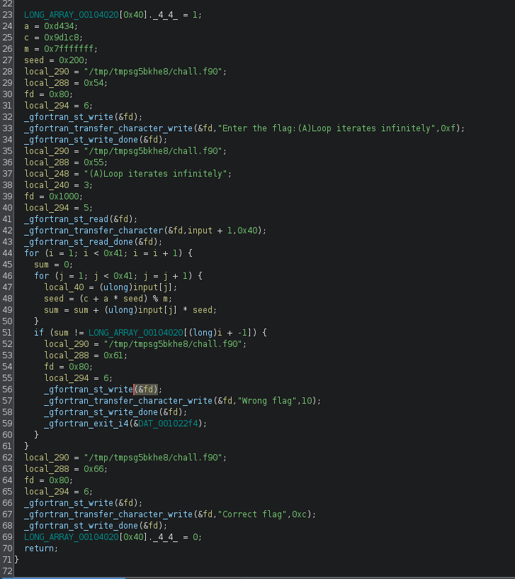

# Funtran [_snakeCTF 2024 Quals_]

**Category**: reversing

## Description

My father was a programmer and his father too, I don't see why I should change their ways.

## Solution

### Step 1: Disassemble the binary

The first step is to disassemble the binary to understand how the flag is checked.
After some analysis of the binary with Ghidra and some cleaning, this is the main function:



The flag is checked using a linear system, so by solving the system it can be recovered.

### Step 2: Solve the system

After extracting the data from the binary, the system can be solved to get the flag.

```Python
import numpy as np

data_solutions = np.array(...) # Data extracted from the binary

a = 54324
c = 643528
m = 2147483647
seed = 512

length = 0x41


def lcg():
    global seed
    while True:
        seed = (a * seed + c) % m
        yield seed

data_matrix = [[next(lcg()) for _ in range(0x40)] for _ in range(0x40)]

flag = np.linalg.solve(np.array(data_matrix), np.array(data_solutions))

flag = np.rint(flag).astype(int)

print(bytes(flag.tolist()))

```
