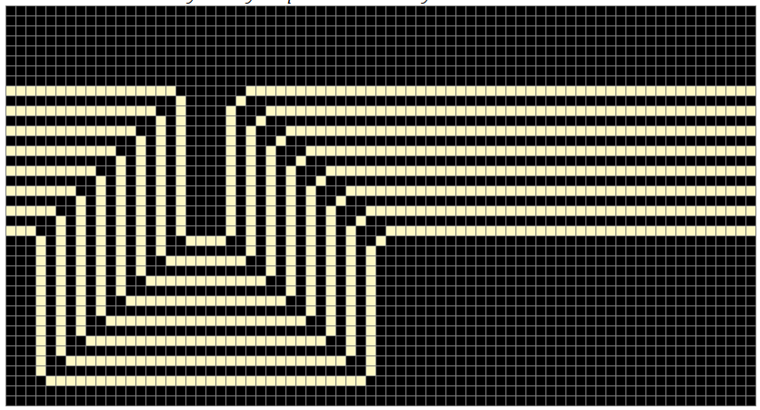

# Rainbow Dragon Road [_snakeCTF 2024 Quals_]

**Category**: reversing

## Description

I found a new circuit, do you want to try to complete it?

It's a very long road to the end, but I'm sure you can do it!

## Solution

### Reversing Haskell

The challenge is a Haskell binary, which requires understanding the calling convention of the language.

After reversing the binary (a more detailed writeup on how to reverse Haskell will be uploaded in the future [here]()),
it is understood that the binary reads a string from the user,
loads the "circuit" with the header:


The rest of the file is a matrix of _WIDTH_ x _HEIGHT_, where each cell is byte.
The matrix is loaded in memory, and the user input is loaded on the first row after stripping the first 18 chars.

Then the code simulates a [wireworld](https://en.wikipedia.org/wiki/Wireworld) automaton for _STEPS_ steps,
where the rules are:

- byte 0x53 → Empty
- byte 0x35 → Electron head
- byte 0x20 → Electron tail
- byte 0x73 → Conductor
- if a cell is a conductor and has one or two electron heads in the eight neighbours, it becomes an electron head
- if a cell is an electron head, it becomes an electron tail
- if a cell is an electron tail, it becomes a conductor
- if a cell is empty, it remains empty

The flag is the string that will place an electron head in the last cell of the matrix after _STEP_ steps.

### Analysis of the circuit

By examining how the flag is placed in the matrix
(the best way to do this is by editing the binary to perform only one step and then checking the matrix),
it becomes clear that each character is placed every 40 cells.

It may be useful to check 40 columns at once,
these are the first two columns (extracted using [this script](attachments/columns_explorer.py)):

```
        3 3 3 3 3 3 3 3                             3 3 3 3 3 3 3 3
       3 3  3 3 3 3  3                              3 3 3 3 3 3 3 3
      3  3 3  3 3 3   3                             3 3 3 3 3 3 3 3
       3 3 3 3  3  3   3                            3 3 3 3 3 3 3  33333333333333
      3  3 3  3  3  3   3                           3 3 3 3 3 3 3                3
     3  3  3   3  3  3 3                            3 3 3 3 3 3  33333333333333  3
      3 3 3     3 3   333                           3 3 3 3 3 3                3 3
       3  3   3 3  3   3                            3 3 3 3 3  33333333333333  3 3
        3  3 333   3  3                             3 3 3 3 3                3 3 3
         3  3 3 3 3  3                              3 3 3 3  33333333333333  3 3 3
          3     3 3 3                               3 3 3 3                3 3 3 3
           3   3  3 3                               3 3 3  33333333333333  3 3 3 3
          3   3  3   3                              3 3 3                3 3 3 3 3
           3 3    3 3                               3 3  33333333333333  3 3 3 3 3
          333    333                                3 3                3 3 3 3 3 3
           3      3                                 3  33333333333333  3 3 3 3 3 3
            3    3 3                                3                3 3 3 3 3 3 3
            3     3                                  33333333333333  3 3 3 3 3 3 3
          33     3                                                 3 3 3 3 3 3 3 3
         3      3                                                  3 3 3 3 3 3 3 3
         3 3    3                                                  3 3 3 3 3 3 3 3
          3 3 3  3                                                 3 3 3 3 3 3 3 3
         3   3333                                     3333333333333  3 3 3 3 3 3 3
        3  33 3                                      3               3 3 3 3 3 3 3
       3  3                                         3   3333333333333  3 3 3 3 3 3
        3  333                                      3  3               3 3 3 3 3 3
         3    3                                     3 3   3333333333333  3 3 3 3 3
          3  333                                    3 3  3               3 3 3 3 3
          3   3                                     3 3 3   3333333333333  3 3 3 3
          3 33 3                                    3 3 3  3               3 3 3 3
           3   3                                    3 3 3 3   3333333333333  3 3 3
               3  3 3                               3 3 3 3  3               3 3 3
                33 3 3                              3 3 3 3 3   3333333333333  3 3
                      3                             3 3 3 3 3  3               3 3
                3    3                              3 3 3 3 3 3   3333333333333  3
               3 3  3                               3 3 3 3 3 3  3               3
               3 3  3                               3 3 3 3 3 3 3   3333333333333
               3 3  3                               3 3 3 3 3 3 3  3
               3  3  3                              3 3 3 3 3 3 3 3
               3   33                               3 3 3 3 3 3 3 3
               3                                    3 3 3 3 3 3 3 3
               3                                    3 3 3 3 3 3 3 3
             33                                     3 3 3 3 3 3 3 3
            3                                       3 3 3 3 3 3 3 3
             33                                     3 3 3 3 3 3 3 3
               3                                    3 3 3 3 3 3 3 3
               3                                    3 3 3 3 3 3 3 3
               3                                    3 3 3 3 3 3 3 3
               3                                    3 3 3 3 3 3 3 3
                3                                   3 3 3 3 3 3 3 3
                 3                                  3 3 3 3 3 3 3 3
                  3                                 3 3 3 3 3 3 3 3
                   3                                3 3 3 3 3 3 3 3
                   3                                3 3 3 3 3 3 3 3
                    3                               3 3 3 3 3 3 3 3
                     3                              3 3 3 3 3 3 3 3
                      33                            3 3 3 3 3 3 3 3
                        3                           3 3 3 3 3 3 3 3
                         3                          3 3 3 3 3 3 3 3
                          3                         3 3 3 3 3 3 3 3
                           3                        3 3 3 3 3 3 3 3
                            3                       3 3 3 3 3 3 3 3
                             3                      3 3 3 3 3 3 3 3
                             3                      3 3 3 3 3 3 3 3
                              3                     3 3 3 3 3 3 3 3
                              3                     3 3 3 3 3 3 3 3
                               3                    3 3 3 3 3 3 3 3
                                3                   3 3 3 3 3 3 3 3
                                 3                  3 3 3 3 3 3 3 3
                                  3                 3 3 3 3 3 3 3 3
                                   3                3 3 3 3 3 3 3 3
                                    3               3 3 3 3 3 3 3 3
                                     3              3 3 3 3 3 3 3 3
                                      3             3 3 3 3 3 3 3 3
                                       3            3 3 3 3 3 3 3 3
3                                      3            3 3 3 3 3 3 3 3
 3                                    3            3  3 3 3 3 3 3  3
  3                                  3            3  3  3 3 3 3  3  33
   3                                3            3  3  3  3 3 3   3   3
    3                              3             3 3  3  3  3 3    3   33 3
     3                            3               3   3 3    3      3    3 3
      3                          3               3 3  3  333  3      3 3 3 3
       3                        3                3  3 3     3  3 33   333  3
        3                      3                 3    3    3 3  3  3   3 3  3
         3                    3                   3  3    3  3     3     3   3
          3                  3                     3 3 3 3  3       3   3   3
           3                3                      3  333  3         3 3   3
            3              3                       3   3 3 3        3  3 3 3
             3            3                        3     3  333    3    333
              3          3                         3    3      3   3     3 3
               3        3                          3    3  3 33   3        3
                3      3                            3    3333    3      3  3
                 3    3                             3      3 3   3     3 33
                  3  3                              3        3    3   3
                  3 3                              3       33      3 333
                  3 3                               3     3         3 3 3
                  3 3                                33333333           3
                  3 3                                     3  3         3
                33  3                                       3         3
               3     3                                     3         3
                3333  3                                   3 333     3
                    3  3                                  3    3   3
                   333 3                                 3    3   3
                    3  3                                3     3 3 3
                   3 3 3                                 3     333
                  3   3                                   3   3 3
                 333  3                                    3  3
                  3   3                                    3  3
                 3 333                                      3  33
                 3                                           3   3
                  3                                          3  3
                   3                                         3 333
                   3                                         3  3
                    3                                         33 3
                     3                                           3
                      3                                         333
                       3                                        3 3
                       3                                         3
                       3                                         3
                       3                                        3
                       3                                       3
                       3                                      3
                  33333                                      3
                 3                                          3
                 3                                          3       33
                 3                                           3     3  3
                 3                                            3    3   3
                 3                                             3  3     3
                 3                                             3 3   33  3
                 3                                              3   3  33
                 3                                                 3
                 3                                                 3
                 3                                                  3
                 3                                                   3
                 3                                                    3
                 3                                                     3
                 3                                                      3
                 3                                                       3
                 3                                                       3
                 3                                                        3
                 3                                                        3
                  3333                                                     3
                      3                                                     3
                       3                                                     3
                       3                                                      3
                       3                                                       3
                       3                                                        3
                       3                                                         3
                       3333333333333333                                           3
                                       3                                           3
                                            3                                      3
   112211122 231113323333 2 312 22321 2      3                                    3
  32 2 32232223 32132 212 3 2 232313232       3                                  3
 22 1211132 1  21 2 32 113331 1311 2213        3                                3
 33312133 2 1 1223112 3232 3  323213333         3                              3
 3322222 21 12 3  2322 212131 23 1  3 3          3                            3
 1 12233 213 123313    3322  22   32 1            3                          3
 1332 2 112 12222212 2221 2311 223 3 23            3                        3
 23212323 31313 2 23 1233 3123333232 22             3                      3
 311 13   2133 131 3112212 1331 2213 31              3                    3
  3 1331 1323123311 12 331122222 2  3                 3                  3
 3 1332122 123122 23313233133 2 123333                 3                3
 223 133231223333211 1112 21221 322112                  3              3
 1 12321223333  3132 3   22 312 3 12332                  3            3
 3 3  2222  223  221312 3 1 22323311311                   3          3
 12312 322133 12 22322 31 3 13112222223                    3        3
 12132 323 3231112 2313    21333223323                      3      3
 11331 3313133 32 211 12 2   1 213333 3                      3    3
 12323 211 11 31 32 31313112 3331 2   3                       3  3
 1  333 12113   21 1123233 3331311213 3                       3 3
 3 3221 31113112 33223231331233312 1322                       3 3
 1112 3331331  21 3 3 221 2  3233132223                       3 3
 3133 1 33  1 1 32 31   2 3 23322221121                       3 3
 31232 3 2  33321 112 231223  3 233 113                     33  3
 1 11222 22 2 231 1  222212 21211333 3                     3     3
 31 2 223 33 23131 12 3332 1 13121113                       3333  3
 322 1 1 3 3222313331 131112  213332312                         3  3
 22 33 3  32 32 331132 321  33 32222 11                        333 3
  2 323 3 2211322223323211331132322131                          3  3
 221 3333  1 12 3 1132 2  3131 32333 3                         3 3 3
  31 13 13131 233 3 2  23222213323121 3                       3   3
 123212231231 132  32121   2333223 2233                      333  3
 1 3113 233221  3133323  2 23 122222312                       3   3
 3 11  21  22221 1 1133  3131 233 1 213                      3 333
  323 22 3121212 22231113122323 2122222                      3
 112312211331322123 22222 33 223 233331                       3
 1213322133313   333 3  313 1321123  13                        3
 32221122 223333  11231 212111 13212213                        3
 1123112333112 31  2 2222 32331 2122311                         3
  22   113 332   2123  121123313332 121                          3
 21  13232211133331 13 2132313123132 11                           3
 222 23 323 22132212222232 322 212312                              3
  2 1 2  2 3131 11 3323    1 33  12213                             3
 12 2212233  32223 1 12123 1113223121 1                            3
 3 32  3 3  3   122 33 2123123112 11313                            3
 31322312  323323311  32132123233 1 33                             3
 32 11231123  112131 1312313232 1  3131                            3
  133 31 333 3      2 11231333 13122 2                        33333
 1223 21 22  11332331232312 13322 3  2                       3
 11 1232131333 3  3 133 32131321 12 3 2                      3
  3 1112   311113 3 3 322 3332 11233133                      3
 31122112221 212221231 222213312 221                         3
 21333  21 2332233 21211231  2  1123                         3
 2123112 213 3  32311  2111 2 1 3222211                      3
 2 2332 1 1    21231 12 1 113 33 312  2                      3
 213222 1 2111 2121332 1311112322333312                      3
 21123323 3   31 2  3121212111 31 33122                      3
 223 323  1 2133223  1221  232121121233                      3
 121 33   223 21 3122 31121212223311321                      3
 2233 2111 3332  121 31 121 1222   22 3                      3
  211321331   213 31333323323 123 13 2                       3
  1121331213  11123121  3221313 2 22111                      3
 111132321 221 33221 2 3232 322112313 2                      3
  132 332131 21322222  32211  2311  322                      3
 3312211 132  3 1331  323 3 123 2132321                      3
 23223 2  22131 3213332222 12 12323 222                      3
 33131121  13212 1 133   11 2123 313132                       3333
 23  3321 33 21213132 3331 1213 2 13                              3
  122 23132321221231 213 221213 2221 1                             3
  32231 3 22 1213   3 13113 2212211  11                            3
 2232332 311  231333123132 21122 2231 1                            3
 2213 12 1 22 3322223 1222 312  2 33123                            3
 1 3 22 31 1  212 2113   1 1221 32 131                             3
   1   2 1131111321 3221322 2 312332211                            3333333333333333
                                                                                   3

   112211122 231113323333 2 312 22321 2        112211122 231113323333 2 312 22321 2
  32 2 32232223 32132 212 3 2 232313232       32 2 32232223 32132 212 3 2 232313232
 22 1211132 1  21 2 32 113331 1311 2213      22 1211132 1  21 2 32 113331 1311 2213
 33312133 2 1 1223112 3232 3  323213333      33312133 2 1 1223112 3232 3  323213333
 3322222 21 12 3  2322 212131 23 1  3 3      3322222 21 12 3  2322 212131 23 1  3 3
 1 12233 213 123313    3322  22   32 1       1 12233 213 123313    3322  22   32 1
 1332 2 112 12222212 2221 2311 223 3 23      1332 2 112 12222212 2221 2311 223 3 23
 23212323 31313 2 23 1233 3123333232 22      23212323 31313 2 23 1233 3123333232 22
 311 13   2133 131 3112212 1331 2213 31      311 13   2133 131 3112212 1331 2213 31
  3 1331 1323123311 12 331122222 2  3         3 1331 1323123311 12 331122222 2  3
  ........
```

It can be noticed how the first column starts as something that looks like a circuit until it becomes random data after 150 rows, for the second after 225, third after 300 and so on.

In fact, every 75 rows the circuit on the pattern seems to change,
this is due to the fact that the circuit is made out of 75 by 40 cell blocks.
The best way to proceed is to analyse each block separately, since there are only 19 unique blocks.

### Analysis of the blocks

These are the types of blocks present in the circuit:

#### Delay Block

Allows the bits of a letter to wait for the previous one to finish

- 40x75 matrix
- Eight input bits
  - bit _i_ is located at position (2 \* _i_) + 8, first column
- Eight output bits (identical to the input)
  - bit _i_ is located at position (2 \* _i_) + 8, last column
- the circuit takes exactly 99 steps to complete (meaning the output should exit the circuit on the 100th step)



#### Checker Block

Takes the output of a block and the output of the previous checker,
performs an AND operation between the two, and returns the result.

- 40x75 matrix
- Two input bits:
  - First bit at position (0,0)
  - Second bit at position (39,0) (bottom-left corner)
- One output bit (AND of the two inputs)
  - Located at position (39,74) (bottom-right corner)
- The circuit takes exactly 99 steps to complete (meaning the output should exit the circuit on the 100th step)


#### Blocks for Checking Single Letters

There are 16 variations of this block, one for each hexadecimal character.
The best way to find the correct letter for each is to simply bruteforce each one individually.

- 40x75 matrices
- 8 input pins:
  - Bit _i_ is located at position (2 \* i) + 8
- 1 output bit:
  - Located at position (39,74) (bottom-right corner)
- The circuit takes exactly 99 steps to complete (meaning the output should exit the circuit on the 100th step)

Example of a block for the letter A:


#### Random block

The last type of block is a random block,
which is a block that does not follow any pattern and is not part of the circuit.

### General Composition

It is now possible to analyse the general composition of the circuit.
[This script](attachments/block_visualizer.py) can be used to better visualise the circuit
(S = delay block, & = checker block, R = random block):

```aiignore
&4SSSSSSSSSSSSSSSSSSSSSSSSSSSSSSSSSSSSSSSSSSSSSSSSSSSSSSSSSSSSSSSSSSSSSSS
R&3SSSSSSSSSSSSSSSSSSSSSSSSSSSSSSSSSSSSSSSSSSSSSSSSSSSSSSSSSSSSSSSSSSSSSS
RR&3SSSSSSSSSSSSSSSSSSSSSSSSSSSSSSSSSSSSSSSSSSSSSSSSSSSSSSSSSSSSSSSSSSSSS
RRR&3SSSSSSSSSSSSSSSSSSSSSSSSSSSSSSSSSSSSSSSSSSSSSSSSSSSSSSSSSSSSSSSSSSSS
RRRR&6SSSSSSSSSSSSSSSSSSSSSSSSSSSSSSSSSSSSSSSSSSSSSSSSSSSSSSSSSSSSSSSSSSS
RRRRR&cSSSSSSSSSSSSSSSSSSSSSSSSSSSSSSSSSSSSSSSSSSSSSSSSSSSSSSSSSSSSSSSSSS
RRRRRR&6SSSSSSSSSSSSSSSSSSSSSSSSSSSSSSSSSSSSSSSSSSSSSSSSSSSSSSSSSSSSSSSSS
RRRRRRR&cSSSSSSSSSSSSSSSSSSSSSSSSSSSSSSSSSSSSSSSSSSSSSSSSSSSSSSSSSSSSSSSS
RRRRRRRR&7SSSSSSSSSSSSSSSSSSSSSSSSSSSSSSSSSSSSSSSSSSSSSSSSSSSSSSSSSSSSSSS
RRRRRRRRR&5SSSSSSSSSSSSSSSSSSSSSSSSSSSSSSSSSSSSSSSSSSSSSSSSSSSSSSSSSSSSSS
RRRRRRRRRR&6SSSSSSSSSSSSSSSSSSSSSSSSSSSSSSSSSSSSSSSSSSSSSSSSSSSSSSSSSSSSS
RRRRRRRRRRR&cSSSSSSSSSSSSSSSSSSSSSSSSSSSSSSSSSSSSSSSSSSSSSSSSSSSSSSSSSSSS
RRRRRRRRRRRR&3SSSSSSSSSSSSSSSSSSSSSSSSSSSSSSSSSSSSSSSSSSSSSSSSSSSSSSSSSSS
RRRRRRRRRRRRR&4SSSSSSSSSSSSSSSSSSSSSSSSSSSSSSSSSSSSSSSSSSSSSSSSSSSSSSSSSS
RRRRRRRRRRRRRR&7SSSSSSSSSSSSSSSSSSSSSSSSSSSSSSSSSSSSSSSSSSSSSSSSSSSSSSSSS
RRRRRRRRRRRRRRR&2SSSSSSSSSSSSSSSSSSSSSSSSSSSSSSSSSSSSSSSSSSSSSSSSSSSSSSSS
RRRRRRRRRRRRRRRR&5SSSSSSSSSSSSSSSSSSSSSSSSSSSSSSSSSSSSSSSSSSSSSSSSSSSSSSS
RRRRRRRRRRRRRRRRR&fSSSSSSSSSSSSSSSSSSSSSSSSSSSSSSSSSSSSSSSSSSSSSSSSSSSSSS
RRRRRRRRRRRRRRRRRR&6SSSSSSSSSSSSSSSSSSSSSSSSSSSSSSSSSSSSSSSSSSSSSSSSSSSSS
RRRRRRRRRRRRRRRRRRR&3SSSSSSSSSSSSSSSSSSSSSSSSSSSSSSSSSSSSSSSSSSSSSSSSSSSS
RRRRRRRRRRRRRRRRRRRR&3SSSSSSSSSSSSSSSSSSSSSSSSSSSSSSSSSSSSSSSSSSSSSSSSSSS
RRRRRRRRRRRRRRRRRRRRR&1SSSSSSSSSSSSSSSSSSSSSSSSSSSSSSSSSSSSSSSSSSSSSSSSSS
RRRRRRRRRRRRRRRRRRRRRR&5SSSSSSSSSSSSSSSSSSSSSSSSSSSSSSSSSSSSSSSSSSSSSSSSS
RRRRRRRRRRRRRRRRRRRRRRR&2SSSSSSSSSSSSSSSSSSSSSSSSSSSSSSSSSSSSSSSSSSSSSSSS
RRRRRRRRRRRRRRRRRRRRRRRR&6SSSSSSSSSSSSSSSSSSSSSSSSSSSSSSSSSSSSSSSSSSSSSSS
RRRRRRRRRRRRRRRRRRRRRRRRR&3SSSSSSSSSSSSSSSSSSSSSSSSSSSSSSSSSSSSSSSSSSSSSS
RRRRRRRRRRRRRRRRRRRRRRRRRR&5SSSSSSSSSSSSSSSSSSSSSSSSSSSSSSSSSSSSSSSSSSSSS
RRRRRRRRRRRRRRRRRRRRRRRRRRR&5SSSSSSSSSSSSSSSSSSSSSSSSSSSSSSSSSSSSSSSSSSSS
RRRRRRRRRRRRRRRRRRRRRRRRRRRR&3SSSSSSSSSSSSSSSSSSSSSSSSSSSSSSSSSSSSSSSSSSS
RRRRRRRRRRRRRRRRRRRRRRRRRRRRR&1SSSSSSSSSSSSSSSSSSSSSSSSSSSSSSSSSSSSSSSSSS
RRRRRRRRRRRRRRRRRRRRRRRRRRRRRR&7SSSSSSSSSSSSSSSSSSSSSSSSSSSSSSSSSSSSSSSSS
RRRRRRRRRRRRRRRRRRRRRRRRRRRRRRR&4SSSSSSSSSSSSSSSSSSSSSSSSSSSSSSSSSSSSSSSS
RRRRRRRRRRRRRRRRRRRRRRRRRRRRRRRR&3SSSSSSSSSSSSSSSSSSSSSSSSSSSSSSSSSSSSSSS
RRRRRRRRRRRRRRRRRRRRRRRRRRRRRRRRR&5SSSSSSSSSSSSSSSSSSSSSSSSSSSSSSSSSSSSSS
RRRRRRRRRRRRRRRRRRRRRRRRRRRRRRRRRR&3SSSSSSSSSSSSSSSSSSSSSSSSSSSSSSSSSSSSS
RRRRRRRRRRRRRRRRRRRRRRRRRRRRRRRRRRR&fSSSSSSSSSSSSSSSSSSSSSSSSSSSSSSSSSSSS
RRRRRRRRRRRRRRRRRRRRRRRRRRRRRRRRRRRR&5SSSSSSSSSSSSSSSSSSSSSSSSSSSSSSSSSSS
RRRRRRRRRRRRRRRRRRRRRRRRRRRRRRRRRRRRR&fSSSSSSSSSSSSSSSSSSSSSSSSSSSSSSSSSS
RRRRRRRRRRRRRRRRRRRRRRRRRRRRRRRRRRRRRR&3SSSSSSSSSSSSSSSSSSSSSSSSSSSSSSSSS
RRRRRRRRRRRRRRRRRRRRRRRRRRRRRRRRRRRRRRR&4SSSSSSSSSSSSSSSSSSSSSSSSSSSSSSSS
RRRRRRRRRRRRRRRRRRRRRRRRRRRRRRRRRRRRRRRR&3SSSSSSSSSSSSSSSSSSSSSSSSSSSSSSS
RRRRRRRRRRRRRRRRRRRRRRRRRRRRRRRRRRRRRRRRR&0SSSSSSSSSSSSSSSSSSSSSSSSSSSSSS
RRRRRRRRRRRRRRRRRRRRRRRRRRRRRRRRRRRRRRRRRR&3SSSSSSSSSSSSSSSSSSSSSSSSSSSSS
RRRRRRRRRRRRRRRRRRRRRRRRRRRRRRRRRRRRRRRRRRR&2SSSSSSSSSSSSSSSSSSSSSSSSSSSS
RRRRRRRRRRRRRRRRRRRRRRRRRRRRRRRRRRRRRRRRRRRR&6SSSSSSSSSSSSSSSSSSSSSSSSSSS
RRRRRRRRRRRRRRRRRRRRRRRRRRRRRRRRRRRRRRRRRRRRR&3SSSSSSSSSSSSSSSSSSSSSSSSSS
RRRRRRRRRRRRRRRRRRRRRRRRRRRRRRRRRRRRRRRRRRRRRR&3SSSSSSSSSSSSSSSSSSSSSSSSS
RRRRRRRRRRRRRRRRRRRRRRRRRRRRRRRRRRRRRRRRRRRRRRR&3SSSSSSSSSSSSSSSSSSSSSSSS
RRRRRRRRRRRRRRRRRRRRRRRRRRRRRRRRRRRRRRRRRRRRRRRR&3SSSSSSSSSSSSSSSSSSSSSSS
RRRRRRRRRRRRRRRRRRRRRRRRRRRRRRRRRRRRRRRRRRRRRRRRR&9SSSSSSSSSSSSSSSSSSSSSS
RRRRRRRRRRRRRRRRRRRRRRRRRRRRRRRRRRRRRRRRRRRRRRRRRR&6SSSSSSSSSSSSSSSSSSSSS
RRRRRRRRRRRRRRRRRRRRRRRRRRRRRRRRRRRRRRRRRRRRRRRRRRR&4SSSSSSSSSSSSSSSSSSSS
RRRRRRRRRRRRRRRRRRRRRRRRRRRRRRRRRRRRRRRRRRRRRRRRRRRR&6SSSSSSSSSSSSSSSSSSS
RRRRRRRRRRRRRRRRRRRRRRRRRRRRRRRRRRRRRRRRRRRRRRRRRRRRR&2SSSSSSSSSSSSSSSSSS
RRRRRRRRRRRRRRRRRRRRRRRRRRRRRRRRRRRRRRRRRRRRRRRRRRRRRR&3SSSSSSSSSSSSSSSSS
RRRRRRRRRRRRRRRRRRRRRRRRRRRRRRRRRRRRRRRRRRRRRRRRRRRRRRR&5SSSSSSSSSSSSSSSS
RRRRRRRRRRRRRRRRRRRRRRRRRRRRRRRRRRRRRRRRRRRRRRRRRRRRRRRR&6SSSSSSSSSSSSSSS
RRRRRRRRRRRRRRRRRRRRRRRRRRRRRRRRRRRRRRRRRRRRRRRRRRRRRRRRR&6SSSSSSSSSSSSSS
RRRRRRRRRRRRRRRRRRRRRRRRRRRRRRRRRRRRRRRRRRRRRRRRRRRRRRRRRR&3SSSSSSSSSSSSS
RRRRRRRRRRRRRRRRRRRRRRRRRRRRRRRRRRRRRRRRRRRRRRRRRRRRRRRRRRR&2SSSSSSSSSSSS
RRRRRRRRRRRRRRRRRRRRRRRRRRRRRRRRRRRRRRRRRRRRRRRRRRRRRRRRRRRR&3SSSSSSSSSSS
RRRRRRRRRRRRRRRRRRRRRRRRRRRRRRRRRRRRRRRRRRRRRRRRRRRRRRRRRRRRR&3SSSSSSSSSS
RRRRRRRRRRRRRRRRRRRRRRRRRRRRRRRRRRRRRRRRRRRRRRRRRRRRRRRRRRRRRR&3SSSSSSSSS
RRRRRRRRRRRRRRRRRRRRRRRRRRRRRRRRRRRRRRRRRRRRRRRRRRRRRRRRRRRRRRR&9SSSSSSSS
RRRRRRRRRRRRRRRRRRRRRRRRRRRRRRRRRRRRRRRRRRRRRRRRRRRRRRRRRRRRRRRR&3SSSSSSS
RRRRRRRRRRRRRRRRRRRRRRRRRRRRRRRRRRRRRRRRRRRRRRRRRRRRRRRRRRRRRRRRR&4SSSSSS
RRRRRRRRRRRRRRRRRRRRRRRRRRRRRRRRRRRRRRRRRRRRRRRRRRRRRRRRRRRRRRRRRR&3SSSSS
RRRRRRRRRRRRRRRRRRRRRRRRRRRRRRRRRRRRRRRRRRRRRRRRRRRRRRRRRRRRRRRRRRR&5SSSS
RRRRRRRRRRRRRRRRRRRRRRRRRRRRRRRRRRRRRRRRRRRRRRRRRRRRRRRRRRRRRRRRRRRR&3SSS
RRRRRRRRRRRRRRRRRRRRRRRRRRRRRRRRRRRRRRRRRRRRRRRRRRRRRRRRRRRRRRRRRRRRR&2SS
RRRRRRRRRRRRRRRRRRRRRRRRRRRRRRRRRRRRRRRRRRRRRRRRRRRRRRRRRRRRRRRRRRRRRR&7S
RRRRRRRRRRRRRRRRRRRRRRRRRRRRRRRRRRRRRRRRRRRRRRRRRRRRRRRRRRRRRRRRRRRRRRR&d
RRRRRRRRRRRRRRRRRRRRRRRRRRRRRRRRRRRRRRRRRRRRRRRRRRRRRRRRRRRRRRRRRRRRRRRR&

```

It can be clearly seen that the diagonal pattern is formed by the & blocks;
immediately before them there is a checker block for a letter, putting this letter together, the flag is formed.
